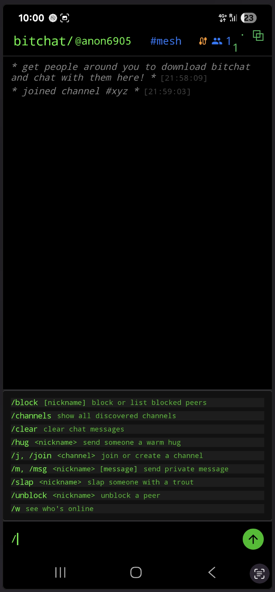
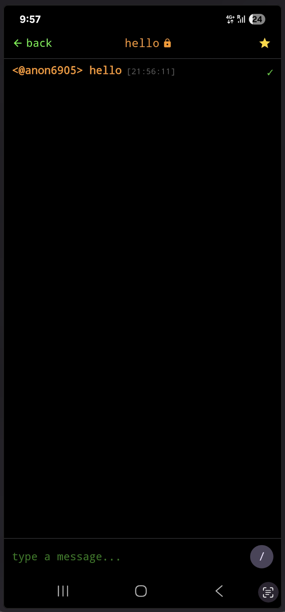

**[Click here](https://mint-t.medium.com/how-palestinians-can-leverage-bitchat-2928080540e5) to see the most up-to-date blogpost version of this README on the Medium website .**

---
 
 

# How Palestinians Can Use BitChat  
*A Messenger App for Secure Private Chatting With or Without Internet Access*  
**Written By: Tech For Palestine Community**  
**Last Updated: Sep 18, 2025**  

---

## What is BitChat?  

BitChat is a messenger that works **with or without the internet**:  

- **Without internet**: Uses Bluetooth to create a **local mesh network** that cannot be shut down.  
- **With internet**: Connects through the **Nostr protocol**, a global decentralized network.  

Unlike WhatsApp or Messenger, BitChat:  
- Doesn’t require phone numbers or accounts  
- Doesn’t rely on central servers  
- Encrypts all messages with the **Noise Protocol**  
- Identifies users by **public key ID + nickname**  

👉 Resistant to **censorship, surveillance, and shutdowns**.  

---

## Why Palestinians Should Use BitChat  

1. **Stay Connected During Outages** – Works even if internet is cut off.  
2. **Privacy & Security** – No numbers, accounts, or corporate servers.  
3. **Dual Connectivity** – Switches between mesh (local) and Nostr (global).  
4. **Geohash Channels** – Join location-based chats (e.g., Gaza City, Palestine).  
5. **No Extra Setup** – Just phones, no servers required.  

---

## How to Use BitChat  

1. Install the BitChat application.  
2. After granting the necessary permissions, you will land on a screen similar to this (your messages list will be empty):  
     
3. In **`bitchat/@symbolic`**, your username is `@symbolic`. You can change it by clicking on it.  
4. Next to it is **`#mesh`**, which is the default location-based channel.  
5. Tap on it to see all available channels. Ignore channels other than `mesh` unless you’re connected to the internet.  
     
6. To the right of the **“type a message...”** box is a **slash icon** inside a circle. Tap it to open the command menu. Each command has its usage listed.
      
7. You can create a new channel using **`/join <channel-name>`** command. For example by typing **`/join xyz`** you will join channel **`xyz`**. It will also create the channel **`xyz`** if not already created.
8. A channel is just like a WhatsApp group. After joining you can message to only users inside it.
> ⚠️ On Android, this feature is still buggy — messages are sent to everyone, not just the channel.  
9. For private messaging: click on the `people icon` (top-right). A side panel will open with users. Click on any one to start a private chat. When you are in private chat, the color will change from **`green`** to **`orange`**.
   
> ⚠️ Private messaging is available, but still requires full security review.  
---

## When to Use BitChat  

- **Internet shutdowns / power cuts**  
- **Private or local communication**  
- **Censorship-free organizing**  
- **Remote / off-grid areas**  
- **Short-term coordination**  

---

## When *Not* to Use BitChat  

- **Long-distance chats** (other apps may be better)  
- **Large files or video calls**  
- **If you need message history** (BitChat stores nothing on servers)  
- **Emergency services** (use official channels if available)  
- **Highly sensitive info** (private messaging not fully audited)  

---

## Conclusion  

BitChat is a **censorship-resistant tool** for Palestinians and others facing restricted internet.  
By learning when and how to use it, communities can **stay connected, safe, and independent** — even in the toughest conditions.  

**More info**: [BitChat GitHub](https://github.com/permissionlesstech/bitchat)  
